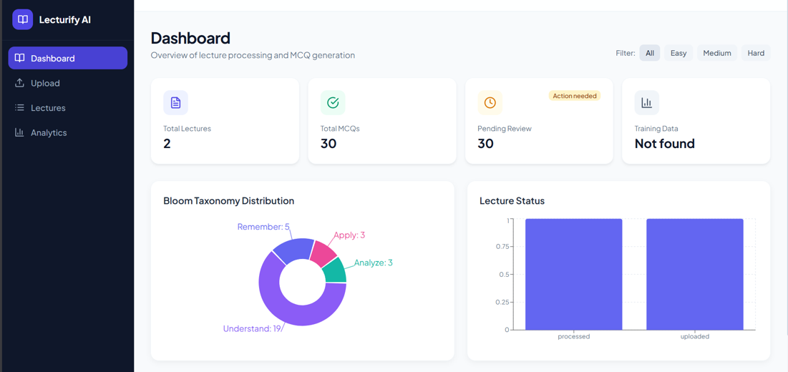
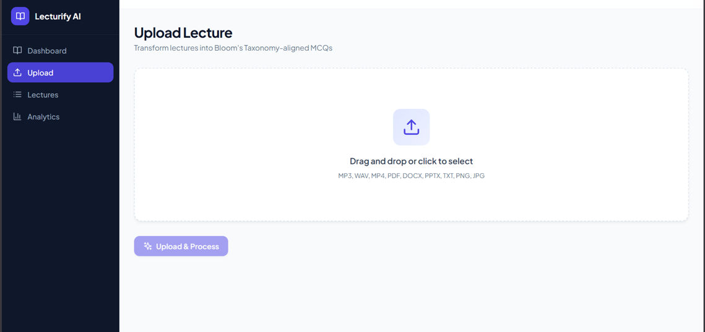
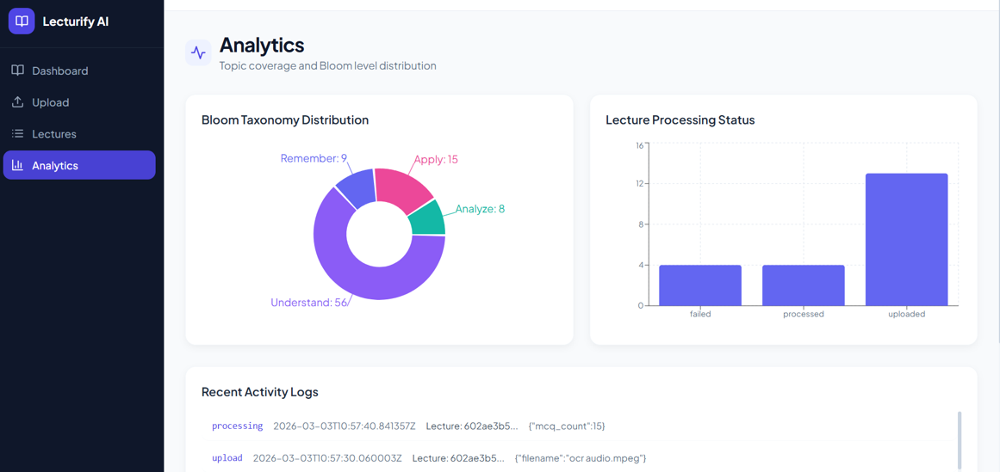
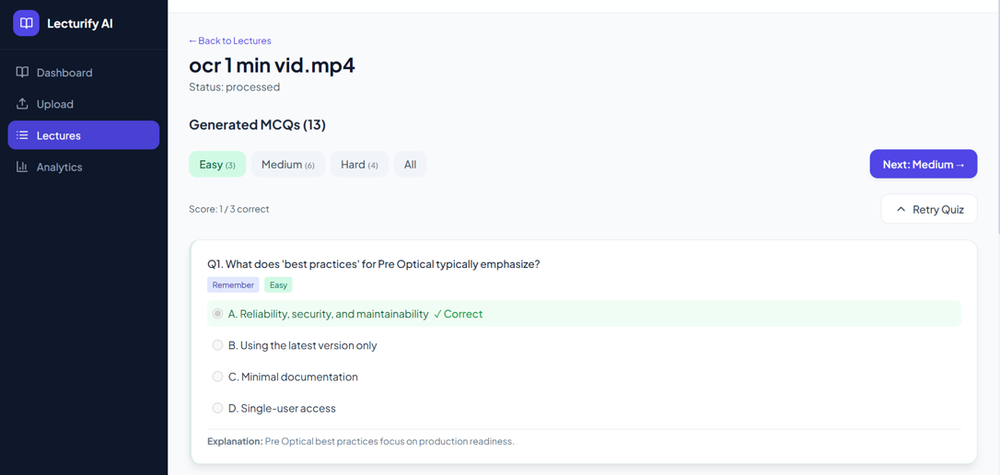
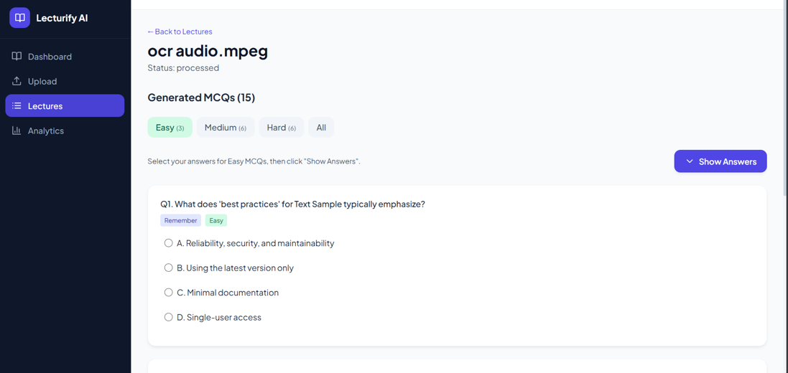
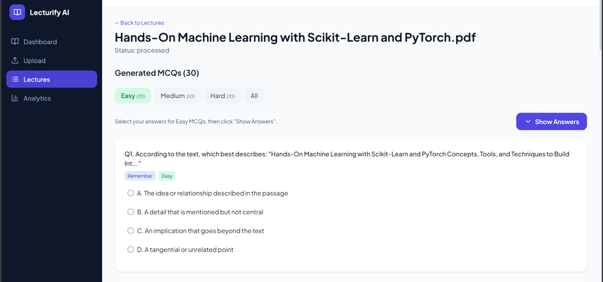
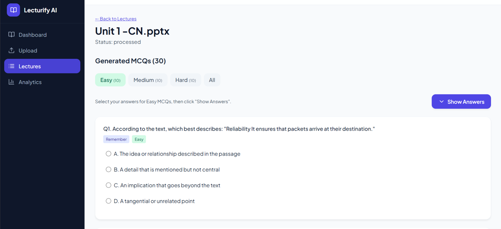
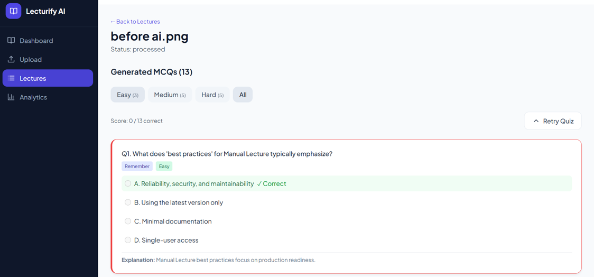

# Lecturify AI – Smart Lecture to MCQ Generator with Bloom's Taxonomy Alignment

A full-stack AI platform that converts lecture content (audio, video, PDF, DOCX, images, or text) into structured MCQs categorized by Bloom's Taxonomy (Remember, Understand, Apply), with dashboards, analytics, and export.

## Architecture (Three-Tier Modular)

1. **Presentation Layer** – React + Vite + Tailwind (frontend)
2. **Application Layer** – Flask REST API, workflow engine
3. **Data & AI Layer** – Whisper (STT), OCR, NLP, MCQ generation, Bloom classifier

All data is stored **locally** – no AWS or cloud storage.

---

## Prerequisites

- **Python 3.9+**
- **Node.js 18+** and npm
- **MongoDB** (local – default `mongodb://localhost:27017/`)
- **Tesseract OCR** (for image OCR – [install Tesseract](https://github.com/tesseract-ocr/tesseract))
- **FFmpeg** – bundled via `imageio-ffmpeg` (install: `pip install imageio-ffmpeg`). Or install [FFmpeg](https://ffmpeg.org/download.html) system-wide.

---

## Project Structure

```
lecturify_ai/
├── frontend/               
│   ├── src/
│   │   ├── components/
│   │   ├── pages/
│   │   ├── api/
│   │   └── hooks/
│   └── package.json
├── backend/
│   ├── app.py              
│   ├── config.py           
│   ├── train_models.py     
│   ├── routes/             
│   │   ├── auth_routes.py
│   │   ├── lecture_routes.py
│   │   ├── mcq_routes.py
│   │   ├── export_routes.py
│   │   └── analytics_routes.py
│   ├── services/
│   │   ├── dataset_loader.py
│   │   ├── stt_module.py
│   │   ├── ocr_module.py
│   │   ├── document_parser.py
│   │   ├── nlp_processing.py
│   │   ├── bloom_classifier.py
│   │   ├── mcq_generator.py
│   │   └── logging_service.py
│   └── models/             
├── storage/
│   ├── uploaded_files/     
│   └── processed_outputs/  
├── datasets/               
├── run_backend.py
├── requirements.txt
└── README.md
```

---

## Configuration

Edit `backend/config.py`:

- `DATASET_PATH` – path to datasets folder
- `MONGODB_URI` – MongoDB connection
- `WHISPER_MODEL` – `tiny` / `base` / `small` / `medium` / `large`
- `WHISPER_LANGUAGE` – `None` for auto-detect (multilingual)

---

## Example Generated MCQ

```json
{
  "question": "Fill in the blank: The stored food in a seed is called ______.",
  "options": ["endosperm", "larval", "membrane", "pollin"],
  "correct_answer": "endosperm",
  "explanation": "The stored food in a seed is called endosperm. It nourishes the embryo...",
  "bloom_level": "Remember"
}
```

## 📸 Screenshots

### Dashboard


### Upload Lecture


### Analytics


### MCQ Generation from Video


### MCQ Generation from Audio


### MCQ Generation from PDF


### MCQ Generation from PPT


### MCQ Generation from Image


## License

MIT
